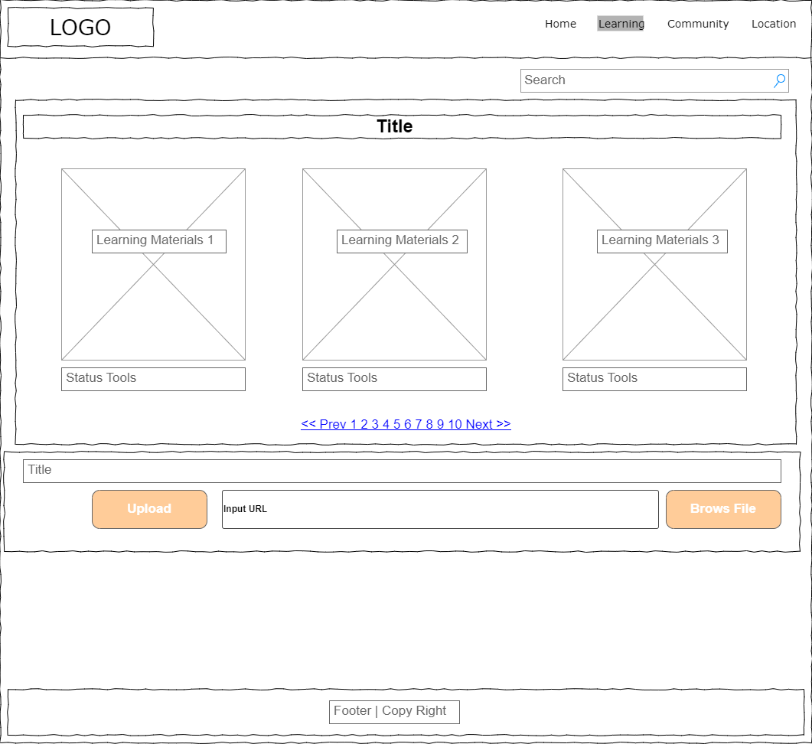

# Capstone Project Definition Statement:
I want to build an application to empower immigrants (new arrivals) as they transition into their new communities.  This web app is a comprehensive, user-friendly resource that addresses the immigrant’s challenges: like learning new skills, integrating into the community, and navigating essential services.

# Target Audience:
1. Newly arrived immigrants seeking support and 2. resources
2. NGOs and community organizations working with immigrant populations
3. Local businesses and services aiming to engage with immigrants

# Define Content of Application
## What do I want on each page? (text / pics / images / navigation)
### Homepage:
- Navigation: Clear links to Learning, Community, and Locations
- Text: Welcome message, brief description of site’s purpose
- Pics: Positive image representing integration into the community
### Learning Page:
- Navigation: Links to specific learning materials (Language, Job Training), resources, back to Home
- Text: Descriptions of learning materials and programs, and instructions.
- Pics: Images of learning materials, icons for different learning categories
### Community Page:
- Navigation: Forum categories, Stories, and sharing stories and resources
- Text: Introduction to the community section, story
- Pics: Story photos, user avatars, images of community gatherings
### Location Page:
- Navigation: Filters for service types, Directions/Public transport info
- Text: Descriptions of each location type, tips for navigating each service
- Pics: Icons for different services (healthcare, grocery stores), photos of local landmarks
### Footer:
- Text: Contact info, legal information
- Pics: Social media icons
- Navigation: Links to social media, privacy policy, contact form

# What do I want the functionality of each page to be?
## Home Page
- Welcome Message: Creates a friendly first impression
- Navigation Bar: Allows easy access to other main sections
## Learning Page
- Learning Materials: Allows users to browse available learning materials.
- Downloadable Resources: Provides access to orientation materials and other educational content
- Video Tutorials: Embeds instructional videos
- Search by category: allow users to find specific learning materials by category.
- Share learning materials: Allow users to upload and share learning materials and resources
## Community Page
- Forum: Offers a space for users to ask questions and share experiences
- User Profiles: Shows profiles and stories of other community members
- Chat Feature: Facilitates real-time conversations
- Share Story and resources: Allow users to publish their success stories and helpful resources
## Locations Page
- Service Filters: Helps users search for specific types of services like healthcare or schools
- Directions: Provides detailed directions and public transport options
- Service Descriptions: Offers info on what each service provides
# What is the purpose of my application?
The purpose of my web application is to create a supportive and comprehensive digital platform for new immigrants. This app aims to help them navigate their new environment by providing essential resources and community connections. By offering tools for learning new skills, integrating into the local community, and accessing important services, my app is designed to help immigrants and make their transition smoother and more welcoming to their new environment.

# What business problem or real-world problem am I going to be solving?
Many new arrivals (immigrants) lack sufficient information about the culture, transportation system, and supermarkets in their new environment. This issue makes it difficult for them to adapt to their new society. Implementing this application can help them overcome these challenges and can significantly improve the lives of immigrants, making their journey smoother, more welcoming, and less stressful.

# The website attribute:
## Color Palette
- Primary Colors: Soft blues and greens for a calming, welcoming feel.
- Secondary Colors: Warm tones like oranges and yellows to add energy and highlight important features.
## Images
High-quality photos showing diverse people in community settings
## Logos
The application logo will feature the Coloring Hands with the text " Assistance" and I will use primary colors to maintain cohesion and clarity, paired with a clear and legible font.
## Navigation
Structure: Clear, concise menu items for Home, Learning, Community, and Locations
Positioning: Fixed at the top of the page for easy access.
Mobile-Friendly: navigation collapses into a hamburger menu on smaller screens

# User Story Mapping

# My research results are as follows:
- [International Institude website] https://www.iistl.org
the above link belongs to the International Institute website which assists new immigrants and refugees in different aspects, this website has an event part that I like and I decided to add this feature to my website in the future.
While I appreciate the website's content, the fonts used in this website don't look good and I don't like it
I have tried that users to be more involved in making the website content and materials and I have provided a user live chat that allows users to make new friends and groups, and this makes a difference.

# Here are the Desktop and mobile Wireframes design for each page of website.
Home page wireframe
 

Learning page wireframe

Community page wireframe

Location page wireframe

# Here is the User Flow Diagram for the website

# Here is the SWOT Analysis for the website

